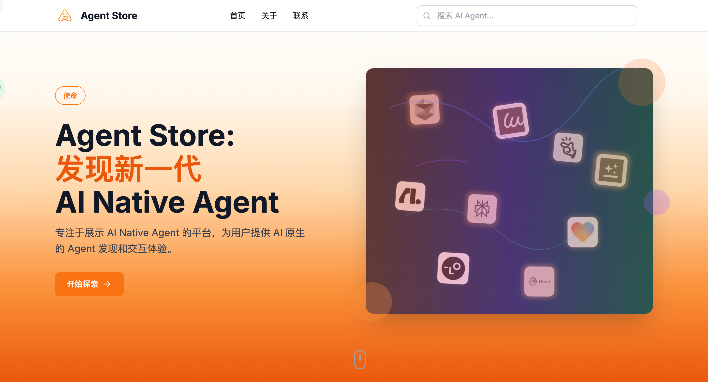

# Agent Store

[](https://opensource.org/licenses/MIT)
[](https://nextjs.org/)
[](https://www.typescriptlang.org/)
[](https://tailwindcss.com/)

> 一个专注于展示高质量 AI Agent 的网络平台，为用户提供全面的 Agent 发现和评估体验。

## 🎯 项目愿景

随着 AI Agent 生态的快速发展，用户面临着信息分散、评估困难的问题。Agent Store 旨在构建一个专业的 AI Agent 展示平台，通过精心策划的内容和直观的用户界面，帮助用户快速发现、了解并选择合适的 AI Agent。



### 核心价值

- **对用户**：一站式 AI Agent 发现平台，提供详细的产品信息和团队背景
- **对 Agent 团队**：专业的展示平台，提升品牌曝光和用户触达
- **对行业**：促进 AI Agent 生态的透明度和健康发展

## ✨ 主要功能

### 🔍 智能发现与浏览
- **分类浏览**：按应用场景（开发工具、计算机视觉、工作流自动化等）和行业分类
- **智能搜索**：支持关键词搜索 Agent 名称、描述和标签
- **多维度筛选**：按分类、行业等维度快速筛选

### 📋 Agent 详情展示
- **基础信息**：Logo、名称、功能描述、官网链接
- **团队背景**：创始人信息、公司简介、技术栈、融资情况
- **媒体动态**：相关文章、视频、播客等媒体内容
- **标签系统**：多维度标签，便于分类和搜索

### 🎨 用户体验
- **响应式设计**：完美适配桌面、平板和移动设备
- **现代化界面**：基于 Tailwind CSS 的简洁美观设计
- **流畅交互**：Framer Motion 动效，提升用户体验

## 🏗️ 技术架构

### 前端技术栈
- **框架**：Next.js 14 + React 18
- **语言**：TypeScript 5.2
- **样式**：Tailwind CSS 3.3
- **动效**：Framer Motion 10.16
- **图标**：Lucide React
- **工具**：ESLint + PostCSS + Autoprefixer

### 项目结构
```
frontend/
├── app/                    # Next.js App Router
│   ├── globals.css        # 全局样式
│   ├── layout.tsx         # 根布局
│   └── page.tsx           # 首页
├── components/            # React 组件
│   ├── Header.tsx         # 页面头部
│   ├── Hero.tsx           # 英雄区域
│   ├── FilterBar.tsx      # 筛选栏
│   ├── AgentGrid.tsx      # Agent 网格
│   └── AgentCard.tsx      # Agent 卡片
├── lib/                   # 工具函数
│   ├── data.ts           # 模拟数据
│   └── utils.ts          # 工具函数
├── types/                 # TypeScript 类型定义
│   └── index.ts          # 类型接口
└── public/               # 静态资源
    └── logos/            # Agent Logo
```

## 🚀 快速开始

### 环境要求
- Node.js 18+
- npm 或 yarn

### 安装步骤

1. **克隆项目**
```bash
git clone https://github.com/your-org/agent-store.git
cd agent-store
```

2. **安装依赖**
```bash
cd frontend
npm install
```

3. **启动开发服务器**
```bash
npm run dev
```

4. **访问应用**
打开浏览器访问 [http://localhost:3000](http://localhost:3000)

### 构建生产版本
```bash
npm run build
npm start
```

## 📊 当前功能状态

### ✅ 已实现功能
- [x] 响应式首页布局
- [x] Agent 卡片展示
- [x] 分类和行业筛选
- [x] 关键词搜索
- [x] 团队信息展示
- [x] 媒体内容展示
- [x] 现代化 UI 设计

### 🚧 开发中功能
- [ ] Agent 详情页面
- [ ] 后端 API 集成
- [ ] 数据库设计
- [ ] 内容管理系统
- [ ] 用户认证系统

### 📋 计划功能
- [ ] AI 智能推荐
- [ ] 用户评价系统
- [ ] 收藏和订阅功能
- [ ] 数据分析和统计
- [ ] 移动端应用

## 🎨 设计特色

### 视觉设计
- **简洁现代**：采用简洁的设计语言，突出内容本身
- **色彩搭配**：使用专业的配色方案，提升品牌形象
- **图标系统**：统一的图标设计，提升视觉一致性

### 交互设计
- **流畅动效**：Framer Motion 提供流畅的页面过渡效果
- **响应式布局**：完美适配各种设备尺寸
- **直观操作**：简单易懂的操作流程

## 🔧 开发指南

### 代码规范
- 使用 TypeScript 进行类型安全开发
- 遵循 ESLint 代码规范
- 组件采用函数式编程风格
- 使用 Tailwind CSS 进行样式开发

### 组件开发
```typescript
// 组件示例
interface AgentCardProps {
  agent: Agent
  onClick?: () => void
}

export default function AgentCard({ agent, onClick }: AgentCardProps) {
  return (
    <div className="bg-white rounded-lg shadow-md hover:shadow-lg transition-shadow">
      {/* 组件内容 */}
    </div>
  )
}
```

### 样式开发
```css
/* 使用 Tailwind CSS 类名 */
.container {
  @apply max-w-7xl mx-auto px-4 sm:px-6 lg:px-8;
}
```

## 🤝 贡献指南

我们欢迎社区贡献！请查看以下指南：

### 贡献方式
- 🐛 报告 Bug
- 💡 提出新功能建议
- 📝 改进文档
- 🔧 提交代码修复
- 🎨 优化用户界面

### 开发流程
1. Fork 项目
2. 创建功能分支 (`git checkout -b feature/AmazingFeature`)
3. 提交更改 (`git commit -m 'Add some AmazingFeature'`)
4. 推送到分支 (`git push origin feature/AmazingFeature`)
5. 创建 Pull Request

## 📄 许可证

本项目采用 MIT 许可证 - 查看 [LICENSE](./LICENSE) 文件了解详情。

## 🔗 相关链接

- [项目文档](./docs/)
- [产品需求文档](./docs/PRD.md)
- [设计规范](./docs/design-system.md)
- [API 文档](./docs/API.md)

## 📞 联系我们

- 项目主页：https://github.com/your-org/agent-store
- 问题反馈：https://github.com/your-org/agent-store/issues
- 邮箱：hello@agentstore.com

## 🙏 致谢

感谢所有为这个项目做出贡献的开发者和设计师！

---

**Agent Store** - 让 AI Agent 的发现与使用变得简单高效 🚀

*构建更好的 AI 生态，从 Agent Store 开始*