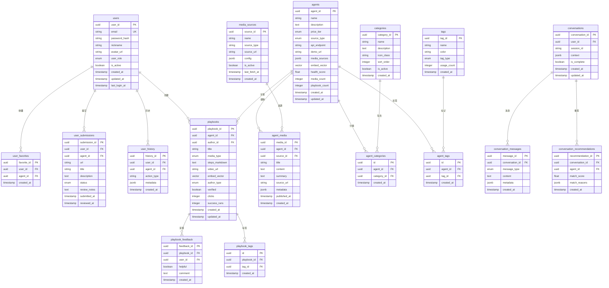
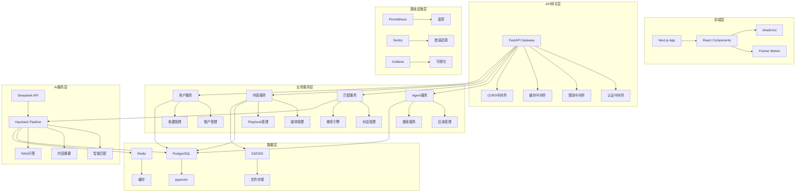
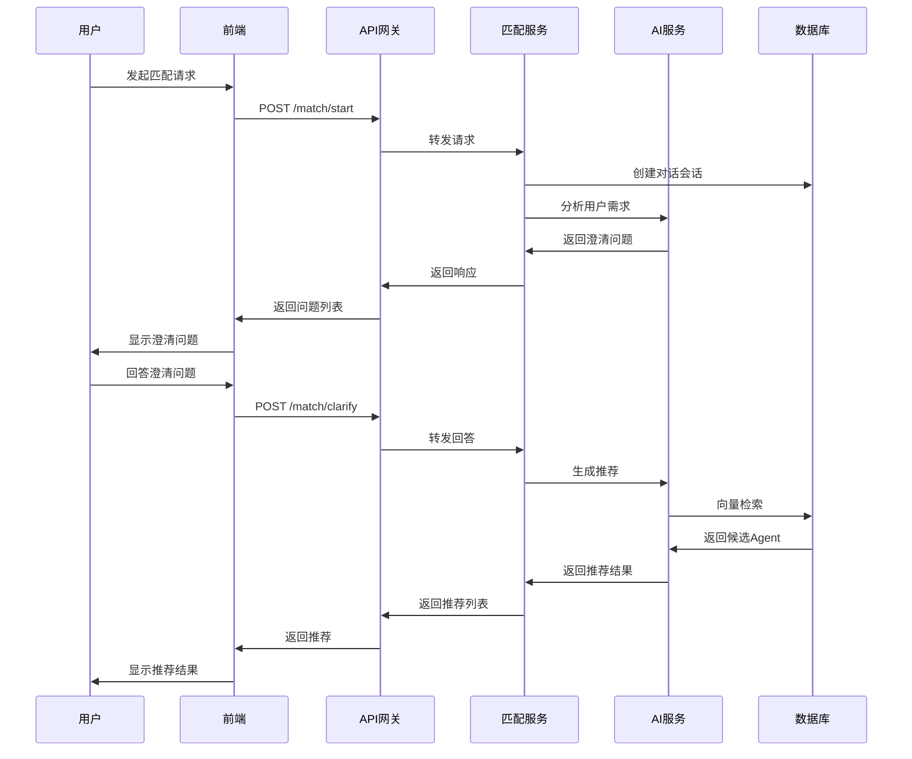
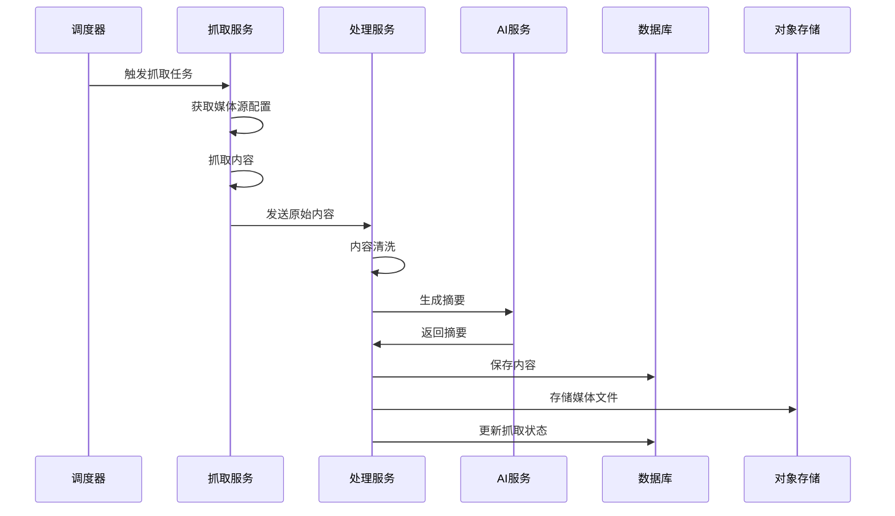
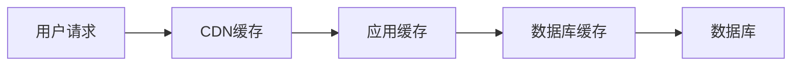

# Agent Store 工程结构与数据结构设计文档 v1.0

---

## 1. 项目概述

### 1.1 技术栈选择
- **前端**: Next.js 14 + React Server Components + TypeScript
- **UI组件**: Tailwind CSS + shadcn/ui + Framer Motion
- **后端**: FastAPI + Python 3.11+
- **数据库**: PostgreSQL 15+ + pgvector 扩展
- **向量存储**: pgvector (PostgreSQL 扩展)
- **LLM框架**: Haystack 2.x
- **LLM服务**: Deepseek API
- **缓存**: Redis 7+
- **对象存储**: AWS S3 / 阿里云OSS
- **监控**: Prometheus + Grafana + Sentry
- **部署**: Docker + Kubernetes / Docker Compose

### 1.2 架构原则
- **微服务架构**: 按业务域拆分服务
- **事件驱动**: 使用消息队列解耦服务
- **CQRS模式**: 读写分离，优化查询性能
- **DDD设计**: 领域驱动设计，清晰的业务边界
- **API优先**: RESTful API + GraphQL (可选)

---

## 2. 数据库设计 (ERD)

### 2.1 核心实体关系图



### 2.2 索引设计

#### 2.2.1 主键索引
- 所有表的主键自动创建唯一索引

#### 2.2.2 业务索引
```sql
-- 用户表索引
CREATE INDEX idx_users_email ON users(email);
CREATE INDEX idx_users_created_at ON users(created_at);

-- Agent表索引
CREATE INDEX idx_agents_name ON agents(name);
CREATE INDEX idx_agents_price_tier ON agents(price_tier);
CREATE INDEX idx_agents_source_type ON agents(source_type);
CREATE INDEX idx_agents_health_score ON agents(health_score DESC);
CREATE INDEX idx_agents_created_at ON agents(created_at DESC);

-- 向量索引
CREATE INDEX idx_agents_embed_vector ON agents USING ivfflat (embed_vector vector_cosine_ops);

-- Playbook表索引
CREATE INDEX idx_playbooks_agent_id ON playbooks(agent_id);
CREATE INDEX idx_playbooks_author_type ON playbooks(author_type);
CREATE INDEX idx_playbooks_verified ON playbooks(verified);
CREATE INDEX idx_playbooks_clicks ON playbooks(clicks DESC);
CREATE INDEX idx_playbooks_embed_vector ON playbooks USING ivfflat (embed_vector vector_cosine_ops);

-- 媒体内容索引
CREATE INDEX idx_agent_media_agent_id ON agent_media(agent_id);
CREATE INDEX idx_agent_media_published_at ON agent_media(published_at DESC);

-- 对话索引
CREATE INDEX idx_conversations_user_id ON conversations(user_id);
CREATE INDEX idx_conversations_session_id ON conversations(session_id);

-- 收藏索引
CREATE UNIQUE INDEX idx_user_favorites_unique ON user_favorites(user_id, agent_id);

-- 提交索引
CREATE INDEX idx_user_submissions_status ON user_submissions(status);
CREATE INDEX idx_user_submissions_submitted_at ON user_submissions(submitted_at DESC);
```

### 2.3 分区策略

#### 2.3.1 按时间分区
```sql
-- 用户历史表按月分区
CREATE TABLE user_history_2025_01 PARTITION OF user_history
FOR VALUES FROM ('2025-01-01') TO ('2025-02-01');

-- 媒体内容表按月分区
CREATE TABLE agent_media_2025_01 PARTITION OF agent_media
FOR VALUES FROM ('2025-01-01') TO ('2025-02-01');
```

---

## 3. 技术架构设计

### 3.1 系统架构图



### 3.2 服务拆分

#### 3.2.1 微服务架构
```
agent-store/
├── api-gateway/          # API网关服务
├── agent-service/        # Agent管理服务
├── matching-service/     # 智能匹配服务
├── content-service/      # 内容管理服务
├── user-service/         # 用户管理服务
├── media-service/        # 媒体抓取服务
├── notification-service/ # 通知服务
└── admin-service/        # 管理后台服务
```

#### 3.2.2 服务职责
- **API Gateway**: 路由、认证、限流、缓存
- **Agent Service**: Agent CRUD、搜索、分类管理
- **Matching Service**: 对话管理、推荐算法
- **Content Service**: Playbook、媒体内容管理
- **User Service**: 用户账户、收藏、历史
- **Media Service**: 内容抓取、摘要生成
- **Notification Service**: 邮件、推送通知
- **Admin Service**: 审核、统计、配置管理

---

## 4. 目录结构设计

### 4.1 前端目录结构
```
frontend/
├── app/                          # Next.js App Router
│   ├── (auth)/                   # 认证相关页面
│   │   ├── login/
│   │   ├── register/
│   │   └── layout.tsx
│   ├── (dashboard)/              # 用户中心
│   │   ├── profile/
│   │   ├── favorites/
│   │   ├── history/
│   │   └── layout.tsx
│   ├── agents/                   # Agent相关页面
│   │   ├── [id]/
│   │   │   ├── page.tsx
│   │   │   ├── playbooks/
│   │   │   └── media/
│   │   └── page.tsx
│   ├── match/                    # 智能匹配
│   │   └── page.tsx
│   ├── playbooks/                # Playbook相关
│   │   ├── [id]/
│   │   └── submit/
│   ├── admin/                    # 管理后台
│   │   ├── agents/
│   │   ├── playbooks/
│   │   ├── media/
│   │   └── stats/
│   ├── api/                      # API路由
│   │   ├── auth/
│   │   ├── agents/
│   │   ├── match/
│   │   └── webhooks/
│   ├── globals.css
│   ├── layout.tsx
│   └── page.tsx
├── components/                   # 可复用组件
│   ├── ui/                       # shadcn/ui组件
│   │   ├── button.tsx
│   │   ├── card.tsx
│   │   ├── dialog.tsx
│   │   └── ...
│   ├── common/                   # 通用组件
│   │   ├── Header.tsx
│   │   ├── Footer.tsx
│   │   ├── Sidebar.tsx
│   │   └── ...
│   ├── agent/                    # Agent相关组件
│   │   ├── AgentCard.tsx
│   │   ├── AgentDetail.tsx
│   │   ├── AgentSearch.tsx
│   │   └── ...
│   ├── match/                    # 匹配相关组件
│   │   ├── MatchDialog.tsx
│   │   ├── RecommendationCard.tsx
│   │   └── ...
│   ├── playbook/                 # Playbook相关组件
│   │   ├── PlaybookCard.tsx
│   │   ├── PlaybookDetail.tsx
│   │   └── ...
│   └── admin/                    # 管理后台组件
│       ├── AgentReview.tsx
│       ├── StatsDashboard.tsx
│       └── ...
├── lib/                          # 工具库
│   ├── api.ts                    # API客户端
│   ├── auth.ts                   # 认证工具
│   ├── utils.ts                  # 通用工具
│   ├── constants.ts              # 常量定义
│   └── types.ts                  # TypeScript类型
├── hooks/                        # 自定义Hooks
│   ├── useAuth.ts
│   ├── useAgents.ts
│   ├── useMatch.ts
│   └── ...
├── store/                        # 状态管理
│   ├── auth.ts
│   ├── agents.ts
│   └── ...
├── styles/                       # 样式文件
│   ├── globals.css
│   └── components.css
├── public/                       # 静态资源
│   ├── images/
│   ├── icons/
│   └── ...
├── next.config.js
├── tailwind.config.js
├── tsconfig.json
└── package.json
```

### 4.2 后端目录结构
```
backend/
├── app/                          # 主应用目录
│   ├── api/                      # API路由
│   │   ├── v1/                   # API版本
│   │   │   ├── auth.py
│   │   │   ├── agents.py
│   │   │   ├── match.py
│   │   │   ├── playbooks.py
│   │   │   ├── media.py
│   │   │   ├── users.py
│   │   │   └── admin.py
│   │   └── dependencies.py       # 依赖注入
│   ├── core/                     # 核心配置
│   │   ├── config.py             # 配置管理
│   │   ├── security.py           # 安全相关
│   │   ├── database.py           # 数据库配置
│   │   └── cache.py              # 缓存配置
│   ├── models/                   # 数据模型
│   │   ├── __init__.py
│   │   ├── user.py
│   │   ├── agent.py
│   │   ├── playbook.py
│   │   ├── media.py
│   │   ├── conversation.py
│   │   └── base.py
│   ├── schemas/                  # Pydantic模式
│   │   ├── __init__.py
│   │   ├── user.py
│   │   ├── agent.py
│   │   ├── playbook.py
│   │   ├── media.py
│   │   └── common.py
│   ├── services/                 # 业务服务
│   │   ├── __init__.py
│   │   ├── agent_service.py
│   │   ├── matching_service.py
│   │   ├── content_service.py
│   │   ├── user_service.py
│   │   ├── media_service.py
│   │   └── notification_service.py
│   ├── repositories/             # 数据访问层
│   │   ├── __init__.py
│   │   ├── base.py
│   │   ├── user_repository.py
│   │   ├── agent_repository.py
│   │   ├── playbook_repository.py
│   │   └── media_repository.py
│   ├── ai/                       # AI相关
│   │   ├── __init__.py
│   │   ├── haystack_pipeline.py
│   │   ├── embedding_service.py
│   │   ├── matching_engine.py
│   │   └── content_summarizer.py
│   ├── tasks/                    # 后台任务
│   │   ├── __init__.py
│   │   ├── media_crawler.py
│   │   ├── health_score_calculator.py
│   │   └── notification_sender.py
│   ├── utils/                    # 工具函数
│   │   ├── __init__.py
│   │   ├── logger.py
│   │   ├── validators.py
│   │   └── helpers.py
│   └── main.py                   # 应用入口
├── tests/                        # 测试文件
│   ├── unit/
│   ├── integration/
│   ├── e2e/
│   └── conftest.py
├── alembic/                      # 数据库迁移
│   ├── versions/
│   ├── env.py
│   └── alembic.ini
├── scripts/                      # 脚本文件
│   ├── init_db.py
│   ├── seed_data.py
│   └── backup.py
├── docker/                       # Docker配置
│   ├── Dockerfile
│   ├── docker-compose.yml
│   └── nginx.conf
├── requirements.txt
├── pyproject.toml
└── README.md
```

---

## 5. 数据流设计

### 5.1 智能匹配流程


### 5.2 内容抓取流程


---

## 6. 缓存策略

### 6.1 缓存层级


### 6.2 缓存配置
```python
# Redis缓存配置
CACHE_CONFIG = {
    "default": {
        "backend": "redis",
        "location": "redis://localhost:6379/0",
        "timeout": 300,
        "key_prefix": "agent_store"
    },
    "agents": {
        "timeout": 3600,  # 1小时
        "key_pattern": "agent:{agent_id}"
    },
    "search": {
        "timeout": 1800,  # 30分钟
        "key_pattern": "search:{query_hash}"
    },
    "recommendations": {
        "timeout": 900,   # 15分钟
        "key_pattern": "rec:{session_id}"
    }
}
```

---

## 7. 安全设计

### 7.1 认证授权
- **JWT Token**: 访问令牌 + 刷新令牌
- **OAuth2**: 支持GitHub、Google、微信登录
- **RBAC**: 基于角色的访问控制
- **API Key**: 管理后台API访问

### 7.2 数据安全
- **数据加密**: 敏感数据AES加密存储
- **传输加密**: HTTPS + TLS 1.3
- **输入验证**: 严格的参数验证
- **SQL注入防护**: 参数化查询
- **XSS防护**: 输出转义

### 7.3 限流防护
```python
# 限流配置
RATE_LIMIT_CONFIG = {
    "default": "1000/hour",
    "search": "100/minute",
    "match": "50/minute",
    "upload": "10/hour",
    "admin": "1000/hour"
}
```

---

## 8. 监控告警

### 8.1 关键指标
- **业务指标**: DAU、转化率、匹配成功率
- **技术指标**: 响应时间、错误率、吞吐量
- **资源指标**: CPU、内存、磁盘、网络

### 8.2 告警规则
```yaml
# Prometheus告警规则
groups:
  - name: agent_store_alerts
    rules:
      - alert: HighErrorRate
        expr: rate(http_requests_total{status=~"5.."}[5m]) > 0.1
        for: 2m
        labels:
          severity: critical
        annotations:
          summary: "高错误率告警"
          
      - alert: SlowResponseTime
        expr: histogram_quantile(0.95, rate(http_request_duration_seconds_bucket[5m])) > 2
        for: 5m
        labels:
          severity: warning
        annotations:
          summary: "响应时间过慢"
```

---

## 9. 部署架构

### 9.1 容器化部署
```yaml
# docker-compose.yml
version: '3.8'
services:
  frontend:
    build: ./frontend
    ports:
      - "3000:3000"
    environment:
      - NEXT_PUBLIC_API_URL=http://localhost:8000
      
  api-gateway:
    build: ./backend
    ports:
      - "8000:8000"
    environment:
      - DATABASE_URL=postgresql://user:pass@db:5432/agentstore
      - REDIS_URL=redis://redis:6379
      
  postgres:
    image: postgres:15
    environment:
      - POSTGRES_DB=agentstore
      - POSTGRES_USER=user
      - POSTGRES_PASSWORD=pass
    volumes:
      - postgres_data:/var/lib/postgresql/data
      
  redis:
    image: redis:7-alpine
    ports:
      - "6379:6379"
      
  prometheus:
    image: prom/prometheus
    ports:
      - "9090:9090"
    volumes:
      - ./monitoring/prometheus.yml:/etc/prometheus/prometheus.yml
      
  grafana:
    image: grafana/grafana
    ports:
      - "3001:3000"
    environment:
      - GF_SECURITY_ADMIN_PASSWORD=admin

volumes:
  postgres_data:
```

### 9.2 生产环境部署
- **负载均衡**: Nginx + HAProxy
- **容器编排**: Kubernetes
- **服务发现**: Consul / etcd
- **配置管理**: ConfigMap + Secret
- **日志收集**: ELK Stack
- **备份策略**: 定时备份 + 异地容灾

---

## 10. 开发规范

### 10.1 代码规范
- **Python**: PEP 8 + Black + isort
- **TypeScript**: ESLint + Prettier
- **Git**: Conventional Commits
- **API**: OpenAPI 3.0 规范

### 10.2 测试策略
- **单元测试**: pytest (Python) + Jest (TypeScript)
- **集成测试**: 数据库 + 外部服务
- **E2E测试**: Playwright
- **性能测试**: Locust

### 10.3 CI/CD流程
```yaml
# GitHub Actions
name: CI/CD Pipeline
on: [push, pull_request]
jobs:
  test:
    runs-on: ubuntu-latest
    steps:
      - uses: actions/checkout@v3
      - name: Run Tests
        run: |
          cd backend && pytest
          cd frontend && npm test
          
  build:
    needs: test
    runs-on: ubuntu-latest
    steps:
      - name: Build Images
        run: docker build -t agent-store .
        
  deploy:
    needs: build
    runs-on: ubuntu-latest
    if: github.ref == 'refs/heads/main'
    steps:
      - name: Deploy to Production
        run: kubectl apply -f k8s/
```

---

## 11. 数据迁移策略

### 11.1 数据库迁移
```python
# Alembic迁移示例
"""Add user_submissions table

Revision ID: 001
Revises: 
Create Date: 2025-01-XX

"""
from alembic import op
import sqlalchemy as sa

def upgrade():
    op.create_table(
        'user_submissions',
        sa.Column('submission_id', sa.UUID(), nullable=False),
        sa.Column('user_id', sa.UUID(), nullable=False),
        sa.Column('agent_id', sa.UUID(), nullable=False),
        sa.Column('url', sa.String(), nullable=False),
        sa.Column('title', sa.String(), nullable=False),
        sa.Column('description', sa.Text(), nullable=True),
        sa.Column('status', sa.Enum('pending', 'approved', 'rejected'), nullable=False),
        sa.Column('submitted_at', sa.DateTime(), nullable=False),
        sa.Column('reviewed_at', sa.DateTime(), nullable=True),
        sa.PrimaryKeyConstraint('submission_id'),
        sa.ForeignKeyConstraint(['user_id'], ['users.user_id']),
        sa.ForeignKeyConstraint(['agent_id'], ['agents.agent_id'])
    )

def downgrade():
    op.drop_table('user_submissions')
```

### 11.2 数据备份恢复
- **全量备份**: 每日凌晨自动备份
- **增量备份**: 每小时增量备份
- **备份验证**: 定期恢复测试
- **异地备份**: 跨地域存储

---

## 12. 性能优化

### 12.1 数据库优化
- **查询优化**: 索引优化 + 查询重写
- **连接池**: 连接复用 + 连接数控制
- **读写分离**: 主从复制 + 读写分离
- **分库分表**: 按时间分区 + 水平分片

### 12.2 应用优化
- **异步处理**: Celery + Redis
- **缓存策略**: 多级缓存 + 缓存预热
- **CDN加速**: 静态资源CDN分发
- **压缩优化**: Gzip + Brotli压缩

### 12.3 前端优化
- **代码分割**: 路由级代码分割
- **懒加载**: 图片 + 组件懒加载
- **预加载**: 关键资源预加载
- **Service Worker**: 离线缓存

---

> **版本记录**
> - v1.0 (2025-01-XX) 基于PRD v0.2和API v1.0创建的工程结构设计文档 